# Documentação sobre CSS3

## índices

00. [O que é o CSS3 e como usá-lo](#documentação-sobre-css3)
01. [Cores e estilos básicos](#corres-e-estilos-básicos)
02. [DevTools](#devtools)
03. [Cores](#cores)
04. [Background e Border](#background-e-border)
05. [Margin e Padding](#box-model-margin-e-padding)
06. [Displays Básicos](#display-none-inline-block-e-inline-block)
07. [Seletores Básicos](#seletores-básicos)
08. [Textos e Fontes](#textos-e-fontes)
09. [Unidades de Medida](#unidade-de-medida)
10. [Herança](#herança)
11. [Especificidade](#especificidade)
12. [Seletores Avançados](#seletores-avançados)

## O que é o HTML e como usá-lo

#### O que é CSS?

- A sigla `css` significa `Cascading Styles Sheets` ou folhas de estilo em cascata.

- A linaguagem é usada para definir os estilos em um documento `html

- Pode ser incluido no documento de 3 modos:

    - Utilizando o atríbuto style, por exemplo:

        ```css

            <h1 style="color: red;">Título Vermelho</h1>
        
        ```

        - Aqui utilizamos a elemento `h1` com a junção do atríbuto de `style="color"` para definição de uma cor ao nosso título.

    - Com a elemento `style`, por exemplo:

        ```css

            <head>
                <style>h1 {
                    color:red;
                }</style>
            </head>

            <body>
                <h1>Título vermelho</h1>
            </body>

        ```

        - Com a elemento `style`, podemos aplicar regras de `css` diretamente dentro do documento `html`, sem precisar de um arquivo externo. Ela deve ser colocada dentro da elemento `head`, que é responsável por conter as informações de configuração e estilo da página.

    - Utilizando a elemento link apontando para um arquivo `css` que é o mais comum, por exemplo:

        ```css

            <link rel="stylesheet" href="style.css">

        ```

        - Adicionamos a elemento `link` para linkar ao nosso `html` e apontamos para o nosso arquivo css com o atríbuto `href=""`, e o atríbuto `rel=stylesheet` informa ao navegador que é uma folha de estilo `css`.

- Estrutura de um código em `css` usando como exemplo um o código:

    ```css

        h1{color: red;}

    ```

    - `h1` é o seletor, ou seja, o termo que seleciona qual parte do documento terá estilo.

    - As chaves `{}` delimitam o bloco de declarações, ou seja, onde começam e terminam os estilos a serem aplicanos no(s) elemento(s) selecionado(s).

    - A declaração `color:red;` define um estilo. Declaração são sempre compostas por duas partes, a `proriedade` e o `valor`, separadas por vírgula, e finalizadas por um ponto e vírgula.

        - Exemplo:

            ```css

                seletor{
                    proriedade: valor;
                    outra-proriedade: valor;
                }

            ```

## Corres e estilos básicos

- Como foi visto ateriormente, existem 2 formas de utilizar o `css` no `html`

    - 1 Utilizando via a elemento `link`
    - 2 Utilizando via atríbuto `style`

- A forma mais comum é criando um arquivo serpado para utiização do código `css` atráves da elemento `link` apontando para o mesmo.

    - Exemplo:

        ```css

            <link rel="stylesheet" href="../001_comeco.css"> <!-- Linkando o ccs por link no arquivo-->
        
        ```
    
    - Utilizando o atríbuto `href=""` para apontar ao destino do arquivo `css` de forma absoluta.

### Cores diretamente no arquivo `css`

- Vale ressaltar que o `css` é em castaca, então a última propriedade definida para determinada elemento vai ser a alterada.

    - Exemplo na prática:

        ```cs 

            p{
                color: white;
            }

            p{
                color: blue;
            }

            p{
                color: red;
            }
        
        ```

    - Resultado:

        - Aqui a cor definida é a cor `red`, já que ela é a última a ser definida, como é em forma de cascata a última sempre será a definida, é um padrão no `css`.

### DevTools

- Irei aborda agora sobre nossa ferramente de desenvolvedor ou `DevTools`.

- Utilizando o `DevTools` podemos mudar o estilo da página e os seus elementos porém de forma temporária, para isso normalmente visualizamos isso na aba do `DevTools` em `Elements` e `Styles`.

    - Exemplo na prática:

        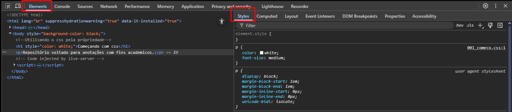

- Posso altera isso de forma temporária, basta selecionar a elemento desejada no `Elements` e alterar o estilo dela no `Styles`, para alterar o `html` é no `Elements` e no `css` no `Estyles`.

    - Exemplo na prática `Elements`:

        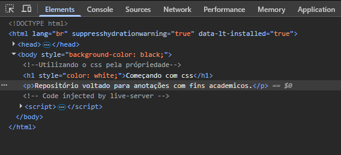

    - Exemplo na prática `Styles`:

        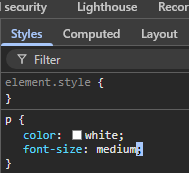

    - Resultado:

        - Como já foi mencionado, toda manipulação feita aqui é reversível a partir do momento que você atualiza a página.

- Também podemos ver todas as própriedade que estão sendo aplicadas em nosso `css` através do `computed`.

    - Exemplo na prática:

        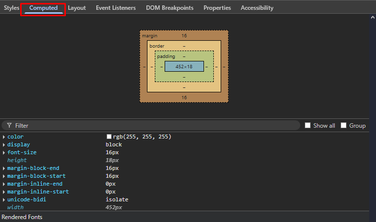

    - Resultado:

        - Observa-se que selecionamos novamente a elemento `p` e ali temos todas as suas propriedades e seu tamanho.

        - margin, border, padding

            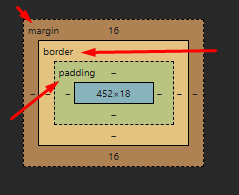

        - margin:

            - Todas as elementos possuem `margin`, que nada mais é que o espaçamento entre as laterais, superior e inferior ao elemento.

        - border:

            - A propriedade `border` define uma borda ao redor de um elemento `html`. 
        
        - padding: 

            - O `padding` é o espaço interno entre o conteúdo de um elemento e sua borda.

        - With e hight:

            - Nada mais é que a altura x largura, representada pelo block azul no centro por `Largura-->452x18<--Altura`.

## Cores

- No `css` podemos trabalhar com cores em vários formatos:

- Usando nome de cores.

    - Podemos utilizar cores no `css` referênciando pelos nomes.

    - Exemplo na prática:

        ```css

            h1 {color: red;}
        
        ```
    
    - Não recomendo, pois não há uma garantia de pradronização das cores, por quê? Por que você trabalha com nome de cores no `css` ele vai utlizar a definição do navegador para a cor que foi determinada pelo nome, que no exemplo foi o `red`.

- Usando os código das cores
    
   - Forma recomendada, pois é específica a cor exata a ser usada de forma precisa.

    - Códigos RGB:

        - Utiliza  a função `rgb()` do `css` para processar uma cor a partir dos valores `red`, `green` e `blue` == `rgb`.

        - Exemplo na prática:

            ```css

                h1{color: rgb(255, 0, 0);}

            ```

        - Resultado:

            - Vale resltar que os números presentes no `rgb` vão do 0 ao 255, e cada valr definido dentro do `rgb`, vai ser o equilibrio de cada cor, em nosso exemplo temos `255, 0, 0`, sendo `255=red` a tonalidade máxima de vermelho, `0=green` a tonalidade zerada de verde e `0=blue` a tonalidade zerada de azul.  

    - Códigos hexadecimais:

        - Utiliza a numeração hexadecimal para especificar cores em formato `rgb` de forma abreviada.

        - O formato usado é o `#RRGGBB`, e os valores são convertidos de hexadecimal para decimal.

        - Números hexadecimais representam os valores decimais de 0 a 15, porém os algarismo `0, 1, 2, 3, 4, 5, 6, 7, 8, 9, A, B, C, D, E e F`.

        - Exemplo na prática:

            ```css

                h1{color: #FF0000;}
            
            ```
        
        - Resultado:
        
           - Onde: `FF=255, 00=0 e 00=0`

    - Códigos HLS:

        - Formato diferente, porém muitoútil para manipulação de cores.

        - Utiliza o esquema de `tonalidade`, `saturação` e `brilho`, ou `Hue`, `Saturation` e `Lightness`, para definir uma cor.

        - Assim como no `rgb`, o `css` também possui uma função `hsl()` 

        - Exemplo na prática:

            ```css

                h1{color: hsl(0, 100%, 50%);}
                
            ```
        - Resultado:

            - Aqui no exempo usamos mais a `satuaração em 100%`, `50% no brilho` e `0% na tonalidade`.

## Background e Border

- Aqui irei aborda um pouco sobre a propriedade no `css` chamada `background` no primeiro momento, em seguida irei da uma atenção a propriedade `border`.

- Background:

    - A propriedade `background` é um atalho para definir valores de fundo individuais em um único lugar na folha de estilo.

    - Exemplo na prática:

        ```css

            header {
                background-color: #000;
                color: #ffffff;
            }

        ```

    - Resultado:

        - Sabemos que o `color` muda a cor dos nomes, enquanto o `background` muda o background de fundo de uma elemento definida. Vale resltar que o `backgroud` funciona tanto com elementos `html` quando com atríbutos, só que com atríbutos só irá funciona caso seja definido um `id` para o atríbuto desejado.

    - Trabalhando com `backgroud` e função `rgb`:

        - Podemos definir um padrão de `red`, `gree` e `blue` no nosso `background`, fica a seu critério.

        - Exemplo na prática:

            ```css
                    
            body{
                background-color: rgb(61, 61, 203);
            }

            ```

    - Trabalhando com `background` e função `url` para imagens.

        - Podemo também utilizar o `background` com imagem por link ou caminho relativo ou absoluto.

        - Exemplo na prática:

            ```css

                body{
                    background-image: url("https://codetheweb.blog/assets/img/posts/css-advanced-background-images/cover.jpg");
                    background-size: cover;
                }

                ```
        
        - Resultado:

            - Aqui utilizamos o `background-image` para definir que utilizariamos uma imagem como `background` porém o `css` não entende se apenas colocamos o link da imagem em `strig`, é necessário utilizar a função `url()` e depois abrir uma `strig` e por o link da imagem lá para que funcione.

            - Também utilizamos a propriedade `background-size` para definição do tamanho da imagem de fundo e a função `cover` que é para cobri todo o fundo da página.

- Border

    - A propriedade `border` é utilizada para definir a borda de um elemento(elemento ou atríbutos com `id`) no `html`, geralmente utilizada para aplicar no elemento para ter as suas características alteradas como o seu tamanho, a sua cor ou seu estilo.

    - Propriedades do `border`

        - Começando com o `border-width` que é a largura da borda.

        - Também temos o `borde-color` para definir a cor da nossa borda.

        - E para que a nossas propriedade `border` funcione precisamos adicionar o tipo de borda que vamos ter, aqui irei utilizar o `borde-style` com a função `solid`.

        - Resultado:

            ```css

                main {
                    background: #e5e5e5;
                    border-width: 4px;
                    border-color: #1c1a1d;
                    border-style: solid;
                }

            ```
        
        - Existem vários tipo de borda, aqui citei só um exemplo, fica a vontade para ir ao `MDN` para pesquisa sobre mais bordas ou no próprio `vscode` é possível ver várias.

- Estilizando uma `div` com `class=""`

    - Aqui irei passar a estilizar um `div` com atríbuto `class` bem rápido.

    - Exemplo:

        ```css

            .box1{
                background-color: #169436;
                border: 4px solid #1c1a1d;
                height: 64px;
                width: 320px;
            }

        ```

    - Resultado:

        - Aqui utilizamos o `.box` para referência uma `class` no `htlm`, utilizamos o `background-color` para definir o fundo, usei a própriedade `border` para definir o tamanho da borda que é `4px` o tipo que é `solid` e sua cor que é `#1c1a1d`, definimos sua altura com `height` e sua largura com `width`.

    - Aqui irei estililizar outra `div` com atríbuto `class`.

    - Exemplo: 

        ```css

            .box2{
            background-image: linear-gradient(to left, #2c2c2c, #f64348);
            height: 64px;
            width: 320px;
        }

        ```

    - Resultado:

        - Aqui utilizamos o `.box` para referência uma `class` no `htlm`, utilizamos o `background-image` para definir o tipo de fundo e `linear-gradient` para definir que o o fundo seja gradiente, utilizei o `linear-gradient(to left, #2c2c2c, #f64348` definindo o gradiente da esquerda para direito e suas cores que foi `#2c2c2c` e `#f64348`, após definir o tamanho de altura e largura que foi ` height: 64px` e `width: 320px`.

    
    - Aqui irei estilizar outra `div` com atríbuto `class`.

    - Exemplo:

        ```css

            .box3{
                background-color: #0077ff;
                border: 2px solid #1c1a1d;
                border-radius: 5px;
                height: 64px;
                width: 320px;
            }

        ```

    - Resultado:

        - - Aqui utilizamos o `.box` para referência uma `class` no `htlm`, utilizamos o `background-color` para definir o fundo, usei a própriedade `border` para definir o tamanho da borda que é `2px` o tipo que é `solid` e sua cor que é `#1c1a1d`, e para deixamos a borda arendondada utilizamos a propriedade `border-radius` com o pixel em 5 `5px` após isso definimos o tamanho de largura e altura que foi `height: 64px;` e `width: 320px;`.

# Box model: margin e padding

- Aqui irei aborda sobre o `box model`, afinal as páginas webs utilizam o modelo de caixa, por isso o nome `box model`, quando se criar uma página `html` ou qualquer coisa web, eles seguem o modelo de caixa.

- Margin: 

    - Todo espaço em volta do elemento é a `margin`, já falei um pouco da `margin` aqui no [DevTools.](#devtools)

    - Exemplo de `margin` na prática:

        ```css

            .box{
                margin-top: 30px; /* margin do topo da página*/
                margin-right: 40px; /* margin do direita da página*/
                margin-left: 40px; /* margin do esquerda da página*/
                margin-bottom: 30px; /* margin da parte inferior da página*/
            }

        ```
    
    - Resultado:

        - Aqui utilizei o `margin-top` para definir um espaçamento entre o topo e o nosso elemento, utilizei o `margin-right` para definir o espaçamento da direita, `margin-left` para definir o espaçamento da esquerda e o `margin-bottom` definir o canto infeior do nosso elemento.

    - Exemplos no DevTools:

        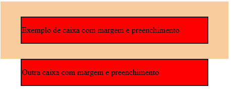

        - Como pode ver as propriedades aplicada do `margin` e seu espaçamento ao redor do elemento.

        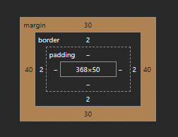

        - Como ver é o `DevTools` e a parte em laranja é nossa `margin`, fica marcado o espaçamento que definimos.

- Padding:

    - Todo elemento tem um preenchemento que é o `padding` ele faz o espaço dentro do elemento, já falei um pouco do `padding` aqui no [DevTools.](#devtools)

    - Exemplo de `padding` na prática:

        ```css

            .box{
                padding-top: 10px;
                padding-right: 20px;
                padding-left: 20px;
                padding-bottom: 10px;
            }

        ```

    - Resultado:

        - Aqui utilizei o `padding-top` para definir o espaçamento no canto superior do elemento, utilizei o `margin-padding-right` para definir o espaçamento do elemento para direito, `padding-left` para definir o espaçamento para esquerda e `padding-bottom` para espaçamento no canto inferior do elemento.

    - Exemplos no DevTools:

        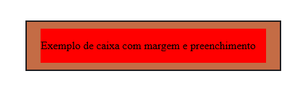

        - Como pode ver as propriedades aplicada do `padding` em seu espaçamento dentro do elemento.

        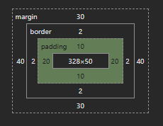

        - Como ver é o `DevTools` e a parte em verde é o nossa `padding`, fica marcado o espaçamento que definimos.

## Display: none, inline, block e inline-block

- Hoje irei aborda as propriedades `display: none`, `inline`, `block` e `inline-block`, existem vários tipos de displays além desses 4 apresentados, só que são os padrões pelos navegadores, além de serem os mais simples.

- `Display: inline`

    - Utilização do `inline` não quebra de linha, largura mínima, apenas aceita margem e preenchimento horizontal.

    - Ocupa apenas o espaço do conteúdo.

    - Fica na mesma linha (não quebra linha).

    - Ignora width e height.

    - `margin/padding` vertical não empurra outros elementos.

    - Exemplo na prática:

        ```css

            .inline{
                margin-top: 10px;       /* ❌ não funciona */
                margin-bottom: 10px;    /* ❌ não funciona */
                margin-left: 20px;      /* ✅ funciona */
                margin-right: 20px;     /* ✅ funciona */
                padding-top: 10px;      /* ⚠️ funciona parcialmente (não empurra outros elementos) */
                padding-bottom: 10px;   /* ⚠️ funciona parcialmente */
                padding-left: 20px;     /* ✅ funciona */
                padding-right: 20px;    /* ✅ funciona */
                width: 200px;           /* ❌ não funciona */
                height: 100px;          /* ❌ não funciona */
            }

        ```

    - Resultado: 

        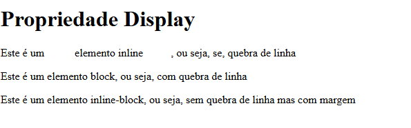

        - Como já foi mencionado, o `inline` não aceita propriedade vertica, ou seja, `top` e `bottom`, aceita apenas na horizontal como `left` e `right`.

- `Display: block`

    - Utilização do `block` quebra de linha, largura máxima, aceita margem e preenchimento vertical

    - Ocupa toda a largura do container

    - Quebra linha antes e depois

    - Aceita width e height

    - Margin e padding funcionam normalmente

    - Exemplo na prática:

        ```css

            .block{
                margin-top: 10px;       /* ✅ aceita */
                margin-bottom: 10px;    /* ✅ aceita */
                margin-left: 20px;      /* ✅ aceita */
                margin-right: 20px;     /* ✅ aceita */
                padding-top: 10px;      /* ✅ aceita */
                padding-bottom: 10px;   /* ✅ aceita */
                padding-left: 20px;     /* ✅ aceita */
                padding-right: 20px;    /* ✅ aceita */
                width: 200px;           /* ✅ aceita */
                height: 100px;          /* ✅ aceita */
            }

        ```

    - Resultado: 

        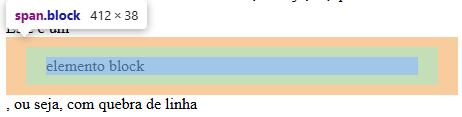

        - No `block` aceitamos quebra de linha e todo tipo de propriedade, e sua margem é vertical além de definimos o widht e height se quisermos.

- `Display: inline-block`

    - Utilização do `inline-block` não quebra linha.

    - Fica na mesma linha como inline

    - Aceita width e height como block

    - Margin e padding funcionam completamente

    - Exemplo na prática:

        ```css

            .inline-block{
                display: inline-block;
                margin-top: 10px;       /* ✅ aceita */
                margin-bottom: 10px;    /* ✅ aceita */
                margin-left: 20px;      /* ✅ aceita */
                margin-right: 20px;     /* ✅ aceita */
                padding-top: 10px;      /* ✅ aceita */
                padding-bottom: 10px;   /* ✅ aceita */
                padding-left: 20px;     /* ✅ aceita */
                padding-right: 20px;    /* ✅ aceita */
                width: 200px;           /* ✅ aceita */
                height: 100px;          /* ✅ aceita */
            }

        ```

    - Resultado: 

        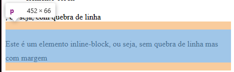

        - O display `inline-block` não quebra de linha mas permite o preenchimento vertical e horizontal como `margin-top/margin/bottom` e `padding-top/padding/bottom`.

- `Display: none`

    - Utilização do `none`apenas esconde os elementos

    - Remove completamente o elemento do layout

    - Não é renderizado nem ocupa espaço

    - Fica invisível e ignorado pelo navegador

    - Exemplo na prática:

        ```css

           .none{
                display: none;
                margin-top: 10px;       /* ❌ ignorado */
                margin-bottom: 10px;    /* ❌ ignorado */
                margin-left: 20px;      /* ❌ ignorado */
                margin-right: 20px;     /* ❌ ignorado */
                padding-top: 10px;      /* ❌ ignorado */
                padding-bottom: 10px;   /* ❌ ignorado */
                padding-left: 20px;     /* ❌ ignorado */
                padding-right: 20px;    /* ❌ ignorado */
                width: 200px;           /* ❌ ignorado */
                height: 100px;          /* ❌ ignorado */
            }

        ```

    - Resultado: 

        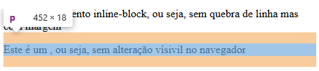

        - O `none` não tem alteração visual no navegador, ou seja, tudo é ignorado.

## Seletores Básicos

- O que são seletores?

    - São um padrões usados para selecionar elementos no `html` específicos para que possam ser estilizados. Eles determinam quais elementos de um documento `html` receberão uma regra de estilo definidas no `css`, e os tipos mais comuns incluem seletores de `class` e `id`, que são seletores básicos, nosso foco serão estes.

    - Seletor universal:

        - O seletor universal nos permite aplicar os estilos em todos os elementos `html`. A representação do seletor universal no `css` é o `*`, o porque utilizar o estilo universal? Para a normalização do estilo no navegador.

        - Exemplo na prática:

            ```css

                *{
                    margin: 0;
                    padding: 0;
                }

            ```
        - Resultado:

            - O seltor universal é utilizado para aplicar estilos em tudo como o próprio nome já diz e também é possíve remover tudo, até mesmo os estilo padrões do navegadores, assim permitindo que nossa estilização seja criada do absoluto zero.

    - Seletor de elemento:

        - O seletor de elemento permite que possamos pegar uma elemento e estilizamos apenas aquele elemento com a elemento específica.

        - Exemplo na prática:

            ```css

                header, footer{
                    background-color: #333;
                    color: #fff;
                    padding: 10px;
                }

            ```

        - Resultado:

            - Aqui estamos utilizando o seletor de elemento, como pode ver, aplicamos diretamento os estilos utilizando as elementos `html`, podemos aplicar o mesmo estilos para várias elementos apenas utilizando a vírgulas para separá-las 

    - Seletor de Elementos aninhados:

        - Seletor de elementos aninhados nada mais é que uma seleção de uma elemento que está dentro de outro elemento, não precisamos separar os elementos por vírgula quando o seletor é aninhados.

        - Exemplo na prática:

            ```css

                nav a {
                    color: #27ae60;
                }

            ```

        - Resultado:

            - Como pode ser visto, estamos utilizando o seletor de elementos aninhados, afinal estamos acessando a elemento `nav` e posteriomente nossas elementos `a` para estilização, por isso é chamado de aninhados, já que acessamos elementos dentro de outro elemento.

    - Seletor de Filhos:

        - O seletor de filhos são aqueles elementos dentro de outro elemento, podemos estilizar o elementos em específico, diferente do seletor aninhado.

        - Exemplo na prática:

            ```css

            nav > a {
                display: block;
                color: #f5a623;
                padding: 10px;
            }

            ```

        - Resultado:

            - Nota-se que, o seletor de filho estilizar apenas o elemento que está dentro de outro elemento, utilizando o sinal maior que `>` e o elemento desejado, aqui pegamos o filho do elemento `nav`, que era um `a` e adicionamos um `block`, `color` e `padding`, observa-se que apenas ele mudou, já que os outros elementos `a` são filhos da elemento `li`.

    - Seletores de Classes

        - Esse é o mais utilizado, podemos ir em nossa `html` e pegar-mos a `class` desejado e estilizar com a nomeclatura `.<node_da_class>`, assim comecariamos a estilizar uma `class`.

        - Exemplo na prática:

            ```css
            
            .laranja{
                color: #f5a623
            }

            .verde{
                color: #27ae60 
            }  

            ```

        - Resultado:

            - Aqui utlizamos o seletor de `class` para estilizar as classes atribuídas como laranja e verde.

    - Seletores de Id

        - Os seletores de `id` quando atribuímos um `id` a um elemento `html`, estilizamos eles a partir do seu `id` no `css`, a nomeclatura utilizada para estilizar um `id` é a seguinte `#<nome_do_id_no_html>`.

        - Exemplo na prática:

            ```css

                #secao-principal{
                    padding: 20px;
                    text-align: center;
                }

            ```

        - Resultado:

            - Utilizamos o `id` para estilizar o elemento `section` em específico, centralizamos todo o texto com um `text-aling: center;` e uma borda com `padding: 20;`.
    
    - Combinação de seletores

        - Podemos fazer a combinação de N seletores.

        - Exemplo na prática:

            ```css

                #secao-principal > * {
                    margin-top: 10px;
                }
            
            ```

        - Resultado:

            - Aqui estamos combinando os seletores `id` com o `*` universsal, juntamos os dois com o símbolos maior que `>` e todos os elementos da seção príncipal ficou com um espaçamento de `10px`.

    - Seletor de Sequência

        - Utilizam combinadores para estilizar elementos com base em sua posição relativa ou na sequência em que aparecem no documento `html`.

        - Exemplo na prática:

            ```css

                input + input{
                    margin-top: 30px;
                    margin-bottom: 30px;
                }

            ```

        - Resultado:

            - Aplicamos o seletor de sequência no nosso `ìnput`, pegamos o primeiro `input` que aplicamos e funciona assim, ele vai estilizar o elemento do segundo`input` mas nunca o primeiro.

    - Seletor de Atríbuto

        - Esse é um dos seletores mais simples de se utilizar, já que iremos pegar como base o atríbuto atribuído lá no `html` a um elemento.

        - Exemplo na prática:

            ```css

                input[name="email"]{
                    background-color: orange;
                }

                input[type="password"]{
                    background-color: green;
                }

            ```

        - Resultado:

            - Aqui estamos estilizanos os input pelos seus atríbutos `name` e `type`, é simples já que se atualizamos um o outro fica exatamente como está, sem alteração nenhuma, já que estamos estilizando ele por seu atríbuto.

## Textos e Fontes

- Para utilizamos apenas o `html` para criar o esqueleto do nosso site, as fontes e os textos podem ser passadas ou moldadas diretamente em nosso arquivo `css`.

    - `texts`:

        - `text-align`:

            - O `text-align` serve para definir o alinhamento horizontal(esquerda ou direita), vertical(cima ou baixo) o texto de uma `tag`, `seletor`, `classe` ou `id` específico.

            - Exemplos:

                ```css

                    header {
                    text-align: center;
                    }

                ```

            - Resultado:

                - Aqui utilizamos o `text-align: center;` para centralizamos o nosso texto no centro com a propriedade `center`.

        - `text-decoration`:

            - O `text-decoration` serve para decorar o nosso texto com nosso seletores como `tag`, `class`, `id` ou `tag`.

            - Exemplos:

                ```css

                    header {
                        text-decoration: underline;
                    }

                ```

            - Resultado:

                - Aqui utilizamos o `text-decoration: underline;` para decorar o nosso texto de uma forma que ele fique sublinhado.

        - `text-tranform`:

            - O `text-tranform` permite modificar os nossos textos para maiúsculo ou minúsculo, `upecase` ou `downcase`.

            - Exemplos:

                ```css

                    header {
                        text-transform: lowercase;
                    }

                ```
            
            - Resultado:

                - Aqui utilizamos o `text-transform: lowercase;` para deixa todas as letras minúsculas.

    -  `Fonts`:

        - `font-family`:
        
            - O `font-family` permite modificar o estilo da font no `html` diratemente no `css`.

            - Exemplos:

                ```css

                    h1 {
                        font-family: cursive;
                    }

                ```

            - Resultado:

                - Aqui utiizamos `font-family: cursive;` para estilizar o estilo de uma fonte no `html` usando o `css`.

        - `font-weight`:

            - O `font-weight` é utilizada para definir o contraste da fonte, se você quer que a fonte fique mais fina ou mais robusta via `css`.

            - Exemplos:

                ```css

                    h1 {
                    font-family: cursive;
                    font-weight: 100;
                    }

                ```

            - Resultado:

                - Aqui utilizamos o `font-weight: 100;` para deixar a fonte com um constraste mais grosso em nossa `font-family: cursive;`.

        - `font-size`:

            - O `font-size` é utilizado para definir o tamanho da fonto no `html` via `css`.

            - Exemplos: 

                ```css

                    h2 {
                    font-size: 16px;
                    }

                ```

            - Resultado: 

                - Aqui utilizamos o `font-size: 16px;` para definir que o tamanho da nossa font é 16px.

        - `letter-spacing`:


            - O `letter-spacing` é utilizado para espaçamento entre as letras do texto via `css`.

            - Exemplos:

                ```css 

                    h2 {
                        font-size: 16px;
                        letter-spacing: 10px;
                        text-transform: uppercase;
                    }

                ```

            - Resultado:

                - Aqui utilizamos o `letter-spacing: 10px;` para um espaçamento entre as letras de 10px, também utilizamos o `font-size: 16px;` para definir o tamanho da fonto em nosso `html` e por fim o `text-trasnform: uppercase;` para deixa todas as letras maiúsculas. 

        - `Google fontes`:

            - O  `google fontes` é um repositório de fontes gratuitas para utilizamos em nosso projeto, para acesesar ! [google fontes](https://fonts.google.com).

            - Escolha a fonte que deseja e importe ela em nosso `css` para utilizamos, você consegue escolhe entre diversos tipos de fontes e de diversos tamanho.

            - Pare importa as fontes do `google fontes` basta escolhe a fonte desejado e clicar em `get font`, após isso clicamos em `get embed code` para geramos o link da fonte tanto para o nosso `html`, se você deseja consumir diretamente no html ou via diretamente `css` com `<link>` or `@import`.

            - Aqui é nosso `get font`:

                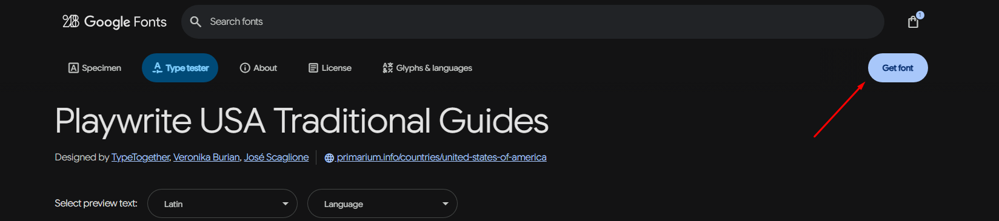

            - Aqui é nosso `get embed code`:

                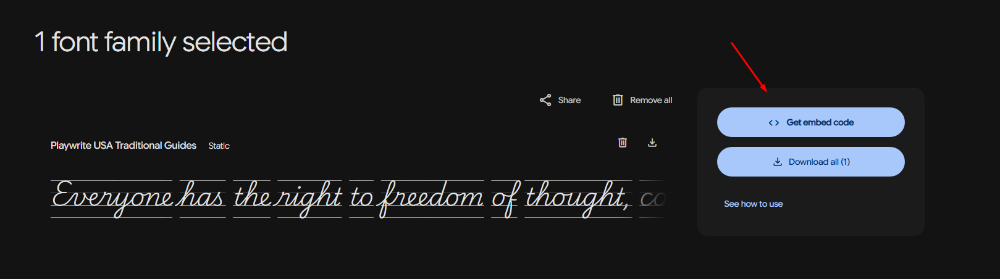

            - Aqui é nosso `<link> and @import`:

                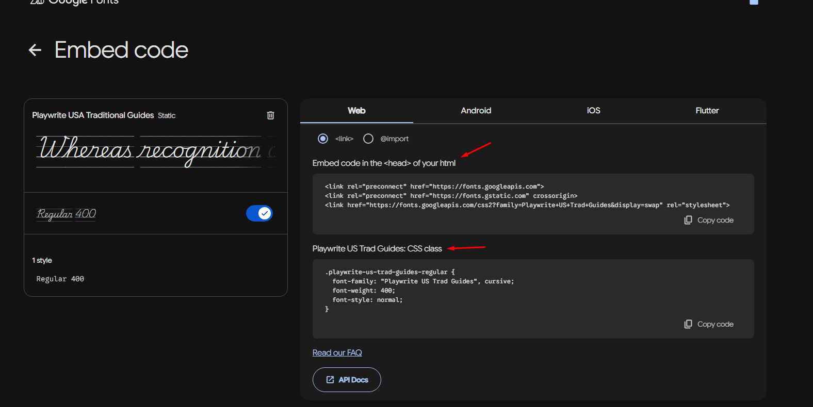

            - Exemplo na prática:

                ```css

                h1 {
                font-family: "Playwrite US Trad Guides", cursive;
                font-weight: 100;
                }

                ```

            - Resultado:

                - Aqui utilizamos o `font-family: "Playwrite US Trad Guides", cursive;` para importa a fonte diretamente do google fontes, lembrando que temos que utilizar o `link` ou `@import` via `html` para utilizar a fonte.


            - `@import`: 

                - Irei mencionar rápidamente o `@import`, podemos importa diretamente a fonte no `css` no lugar de `link` via `html`, que é o recomendado.


                - Exemplo:

                    ```css

                        @import url('https://fonts.googleapis.com/css2?family=Playwrite+US+Trad+Guides&display=swap');

                        h1 {
                        font-family: "Playwrite US Trad Guides", cursive;
                        font-weight: 100;
                        }

                    ```

                - Resultado:

                    - Aqui é simples, no lugar do `link` via `html`, utilizamos o `@import` dentro do `css`.

## Unidade de Medida

- O que são unidades de medida?

    - Unidade de medida no `css` são o tamanho que determinamos de algo, geralmente utilizamos `px`, `rem`, `em`, `%`, `vh` ou `vw`. Elas ajudam a criar layouts que se ajustam ao design desejado. Cada unidade tem características próprias, e escolher a unidade certa pode impactar na flexibilidade e no comportamento do design.

        - `px`:

            - O `px` é a unidade de medida mais básica, já que representa um pixel na tela e é a menor unidade de medida, representando um pixel.

            - É a unidade mais precisa e previsível, uma vez que o valor não muda, independentemente do dispositivo ou configurações de zoom.

            - Não é responsivo, ou seja, o layout pode não se ajustar bem em diferentes tamanhos de tela ou dispositivos.

            - Exemplo:

                ```css

                    header{
                        background-color: #232323;
                        color: #fff;
                        padding: 10px;
                    }

                ```

            - Resultado:

                - Aqui utilizei um `background-color: #232323;` para deixa o fundo escuto e um `color: #fff;` para deixa a lestra branca, finalizando com um `padding: 10px;` da nossa unidade de meida básica que é o pixel, foram 10 pixel.

        - `rem`:

            - O `rem` é a unidade medida que é uma unidade relativa baseada no tamanho da fonte do elemento raiz `html`. Por padrão, o valor do tamanho de fonte raiz é `16px`, então `1rem` é igual a `16px` (a menos que você altere explicitamente o tamanho da fonte na tag `html`).

            - Melhor para layouts responsivos, já que o valor é relativo ao tamanho da fonte raiz, facilitando ajustes de escala em toda a página ao alterar o tamanho da fonte do elemento raiz.

            - Pode ser mais difícil de calcular e entender se você não estiver acostumado com a ideia de unidades relativas.

            - Exemplo:

                ```css

                    .rem{
                        height: 3rem;
                    }

                ```

            - Resultado:

                - Aqui utilizei o `rem` que é basicamente é um multiplicador 3x do pixel, sem conta que ele é responsivo e não absoluto como o `px`.

        - `em`:

            - O `em` como o `rem`, o `em` é uma unidade relativa, mas, em vez de se basear no tamanho da fonte do elemento raiz, ele se baseia no tamanho da fonte do elemento pai.

            - Útil para definir tamanhos relativos dentro de um componente ou elemento específico, permitindo herança de estilos.

            - Pode ser confuso em hierarquias de elementos, pois o valor depende do tamanho da fonte do elemento pai. Isso pode criar efeitos inesperados em componentes aninhados.

            - Exemplo:

                ```css

                    .em{
                        font-size: 32px;
                        height: 2em;
                    }

                ```

            - Resultado:

                - Aqui utilizamos o `em` básicamente para mostra como ele funciona, como já mencionado ele é baseado no elemento raiz que é o `root element`.


        - `%`:

            - O `%` é relativa ao tamanho do elemento pai. Por exemplo, se um elemento tem largura de 50%, isso significa que a largura do elemento será metade do tamanho do seu elemento pai.

            - Boa para criar layouts flexíveis e responsivos, já que o tamanho muda de acordo com o tamanho do contêiner.

            - O cálculo de tamanho pode se tornar complicado dependendo da estrutura do layout.

            - Exemplo:

                ```css

                .prcnt-33{
                    height: 33%;
                }

                ```

            - Resultado:

                - Aqui utilizamos o `height: 33%;`, nosso elemento pai tem 100%, ou seja a altura do nosso `%` vai ser exatamente 33% dos 100% do elemento pai.

        - `vh`:

            - O `vh`, `1vh` é igual a `1%` da altura da janela de visualização (viewport). Ou seja, se a altura da janela de visualização for `1000px`, `1vh` será `10px`.

            - Útil para criar layouts que se adaptam à altura da tela, como cabeçalhos ou seções de altura completa.

            - Pode ser problemático em dispositivos móveis, pois a altura da janela de visualização pode variar devido a barras de navegação ou outras mudanças na interface do dispositivo.

            - Exemplo: 

                ```css

                    .vh {
                        height: 30vh;
                    }

                ```

            - Resultado:

                - Utilizamos o `vh` para que o atríbuto com `id` `vh` seja responsivo a tela em determinado tamanho, em nosso caso foi o `30vh`, a medida que a tela expande ou diminui o `30vh` ocupa apenas 30% da tela.

        - `vw`:
           
           - o `vw` é relativas ao tamanho da janela de visualização (viewport). `1vh` é `1%` da altura da tela, e `1vw` é `1%` da largura da tela.

           - Excelentes para designs responsivos e full-screen, pois o layout se adapta ao tamanho da tela do usuário.

           - Não funcionam bem em todos os contextos, como com elementos que devem ser dimensionados independentemente da tela.

           - Exemplo:

                ```css

                    .vw {
                        height: 30vw;
                    }

                ```

            - Resultado:

                - Utiizamos o `vw` para que o atríbuto com `id` `vw` seja repsonsivo em determiando tamanho, no nosso caso foi `30vw`, ou seja a largura da tela, enquanto o `vh` é responsivo é altura da tela.

## Herança           

- A `herança` no `css` funciona dessa forma, você aplica estilos em determinado elemento e os outros elementos que estão dentro do primeiro elemento herdam suas características.

- Exemplo:

    ```html

        <header>
            <h1>Herança no CSS</h1>
        </header>

    ```

    ```css

        header {
            background-color: #232323;
            color: #fff;
            text-align: center;
            padding: 1rem;
        }

    ```

- Resultado:

    - No exemplo aplicamos tudo no `header` do `html`, repare que dentro do `header` temos a tag `h1`, por meio da herança todos as propriedades do `css` aplicadas no `header` vão herda tudo para `h1`, esse é o conceito de `herança` no `css`.

    - Vale resaltar que apenas algumas propriedades são herdadas, outras não. 

## Especificidade
            
- A especifidade determina a ordem de prioridade das regras `css` que se aplicam a elementos `html`.

    - Ordem de aplicação das regras:

        - Pelo formato de cascata do `css` os estilos são aplicados em uma ordem sequencial.

        - Regras definidas inline têm a maior especificidade.

        - Regras em arquivos externos sã aplicadas por últumo e têm menor especificidade.

    - Epecificidade de seletores:

        - Seletores universais têm baixa especificidade.

        - Seletores de tipo têm uma especificidade maior que os universais.

        - Seletores de classe e atríbuto têm maior especificidade que os seletores de tipo.

    - Combinação de seletores:

        - Quando múltiplos seletores se aplicam a um elemento, suas especificidade se somam.

        - A ordem dos seletores também importa em casos de empate na especificidade.

    - `!important`:

        - O `!important` sobrepõe todas as outras regras de especificidade.

        - Evite o uso excessivo de `!important` para não prejudica a manutenção do código.

    - Resumão:

        - Ordem da cascata:

            - Estilos inline:

                - Estilos definidos diratamente no elemento `html` usando atríbuto `style`

            - IDs:

                - Seletores com `id` específicos, como `#myElement`

            - Classes, Pseudo-classes e Atríbutos:

                - Seletores como classes `.myClass`, pseudo-classes `:hover, :nth-child()` e seletores de atributos `[type="text"]`

            - Elementos e Pseudo-Elementos:

                - Seletores que se refere a elementos `html`, `div, p` e pseudo-elementos `::before, ::after`

        - Pontuações de especificidade:

            - Estilos inline `1000 pontos`

            - IDs `100 pontos`

            - Classes, Pseudo-classe e Atríbutos `10 pontos`

            - Elementos e Pseudo-elementos `1 ponto`

    - Exemplos na prática:

        ```html

            <body>
                <h1>Especificidade</h1>
            </body>

        ```

        ```css
        
            body > h1{
                color: #0f0;
            }

            h1{
                color: #f00;
            }

         ```

    - Resultado:

        - Como pode ver na prática, o título `h1` ficou verde e não vermelho, porquê? Por conta que a regra de `especificidade` que aplicamos no `body > h1` sobrepõe a regra de cascata do `css`, por isso o `h1` ficou verde no lugar de vermelho.

## Seletores Avançados

- Os seletores avançado no `css`, nos permite estilizar partes do `html` com mais precisão usando a relações entre eles.

- Seletores:

    - `:nth-child()`:

        - Este seletor avançado selecionar a tag por uma ordem específicada, também podendo multiplicar o mesmo dessa forma `:nth-child(2n)`, ele selecionar elementos com base em sua ordem dentro do pai.

        - Exemplos:

            ```html

            <li>item 1</li>
            <li>item 2</li>
            <li>item 3</li>
            <li>item 4</li>
            <li>item 5</li>

            ```

            ```css

                li:nth-child(2){
                    color: #f00;
                }

                li:nth-child(2n){
                    color: #00f;
                }

            ```

        - Resultado:

            - Neste exemplos utilizamos dois tipos de `:nth-child()`, um para selecionar a tag `<li>`  número dois e a outra para selecionar as duas tag `<li>` de uma multipla.

    - `hover`:

        - O `hover` é um seletor de estado, quando se clica, selecionar ou passar o mouse por cima de um elemento isso é o estado, `hover` trabalha na estilização desses estados.

        - Exemplos:

            ```html

                <section>

                    <h2>Tipos de seletores</h2>

                    <ul>
                        <li>item 1</li>
                        <li>item 2</li>
                        <li>item 3</li>
                        <li>item 4</li>
                        <li>item 5</li>
                    </ul>

                </section>

            ```

            ```css

                li:hover{
                    background-color: gray;
                }

            ```

        - Resultado:

            - Aqui utilizamos o `hover` para que toda vez q passarmos o mouse por cima de qualquer `<li>`, ela ficar com um `backgroud-color: gray;`.  

    - `::before` e `::after`:

        - O `::before` e `::after` são pseudos-elementos `css` que permitem inserir conteúdo antes ou depois de um elemento sem modificar o `html`.

        - Ponto negativo dos pseudo-elementos é que não são clicaveis, conteúdo não é selecionável como texto normal e limitados em certas propriedades `css`.

        - Exemplos:

            ```html

                <ul>
                    <li>item 1</li>
                    <li>item 2</li>
                    <li>item 3</li>
                    <li>item 4</li>
                    <li>item 5</li>
                </ul>

            ```

            ```css

                li::before{
                    content: " (antes) ";
                }

                li::after{
                    content: " (depois) ";
                }

            ```

        - Resultado:

            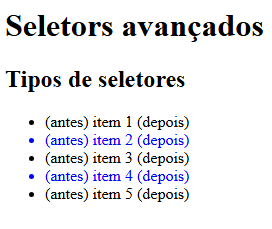

            - Como visto no exemplo utiliamos tanto `::before` qunato `::after` para gerar uma pseudo-elemento sem alteração no `html`.

    - `:first-child` e `:last-child`:

        - O `:first-child` é uma pseudo-classe do CSS que seleciona o primeiro elemento filho dentro de um elemento pai, quanto `:last-child` é uma pseudo-classe do `css` que seleciona o último elemento filho dentro de um elemento pai.

        - Exemplos:

            ```html

                <ul>
                    <li>item 1</li>
                    <li>item 2</li>
                    <li>item 3</li>
                    <li>item 4</li>
                    <li>item 5</li>
                </ul>

            ```

            ```css

                li:first-child{
                    color: rgb(255, 174, 0);
                }

                li:last-child{
                    color: rgb(255, 0, 179);
                }

            ```

        - Resultado:

            - Aqui utilizamos o `:first-child` para estilizar a primeiro propriedade filho do `html` via `css`, também utilizamos `:last-child` para estilizar o último propriedade filho do `html` via `css`.

    - `:not()`:

        - O `:not` é uma pseudo-classe de negação(ou inversão de um seletor) que seleciona elementos que não correspondem a um seletor específico.

        - Exemplos:

            ```html

                <ul>
                    <li>item 1</li>
                    <li>item 2</li>
                    <li>item 3</li>
                    <li>item 4</li>
                    <li>item 5</li>
                </ul>

            ```

            ```css

                li:not(:first-child){
                    color: #f00;
                }

            ```

        - Resultado:

            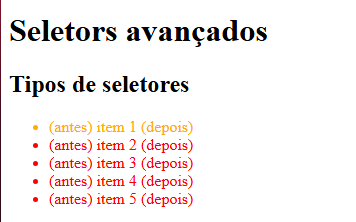

            - Aqui utilizamos o `li:not(:first-child)` para negar todos os que não são o primeiro elemento ficarem da cor `#f00`(vermelho).

